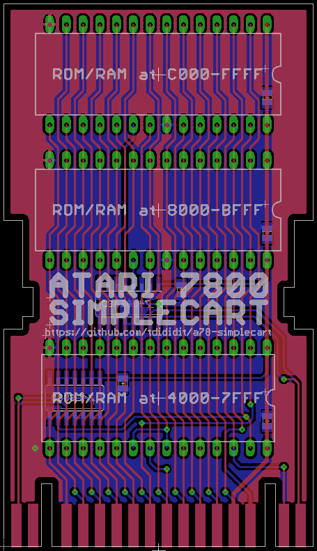

Atari 7800 SimpleCart
---------------------

Universal non bankswitch ROM/RAM cartridge for Atari 7800

Can be populated with 27c128 EPROMs and 62c256 SRAMs to met your homebrew requirements.

The board fits into original Atari 7800 Cart case - screw post need to be removed.

Atari 2600 Cart case require few cuts on dustcover.

 

